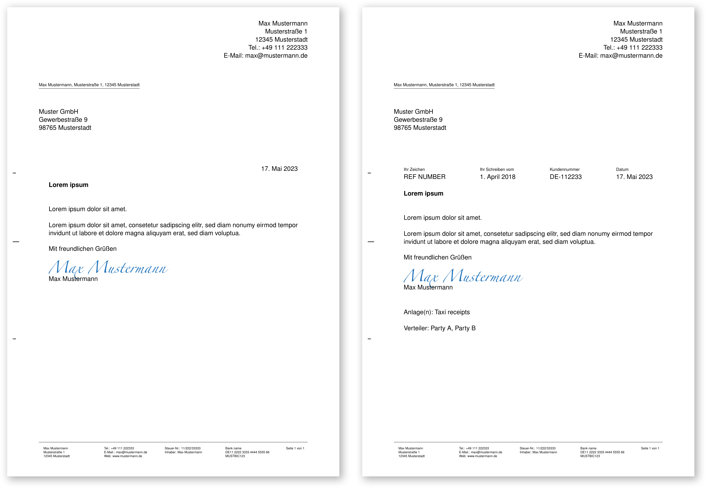
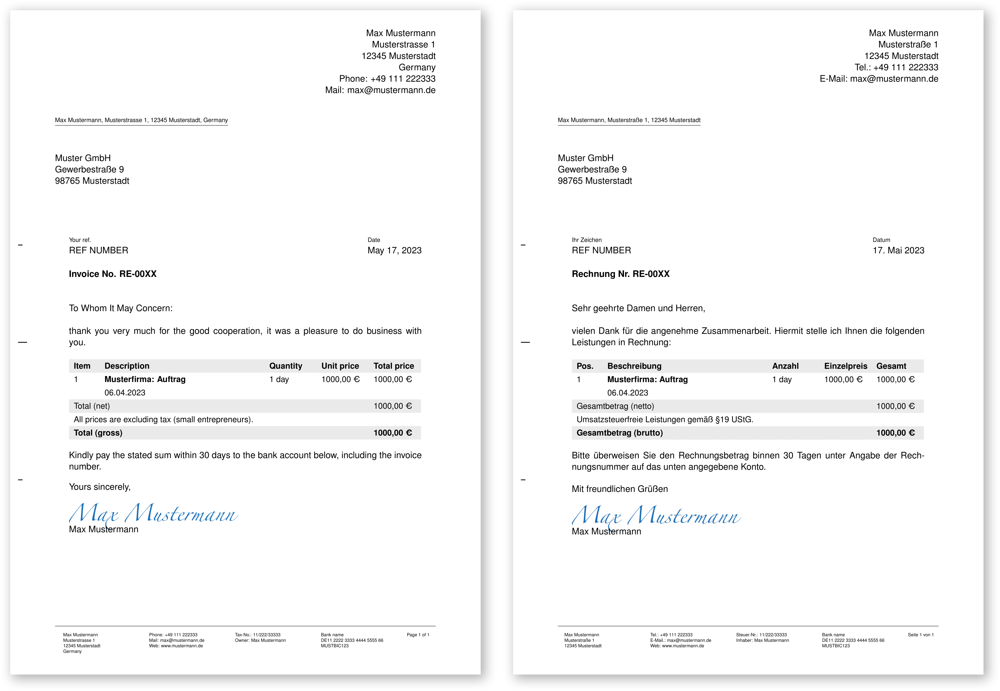

# DIN5008 letter & invoice template for LaTeX
[![CC BY-NC-SA 4.0][cc-by-nc-sa-shield]][cc-by-nc-sa] [](https://github.com/GIScience/badges#active)

A DIN5008 compliant LaTeX template for invoices and letters.

## Styling
In this package you will find a template for a letter and one for an invoice, named `letter.tex` and `invoice.tex`. These two documents come with different options like support for a reference and customer number.

### Language
The two documents are combined for English and German language, which is especially useful when writing invoices to foreign companies.
By leaving `\selectlanguage{english}`, the invoice's blindtext, adress information, date, etc. will become English, and by commenting said line (eg. `%\selectlanguage{english}`), all the text will switch back to German.

You can also add or customize language snippets:
```tex
\lang{english}{English text}{German text}
```

### Personalisation
To personalize the documents, you can edit `author.tex` and `footer.tex` to your liking. I have put the code in seperate files, since it doesnt change in my usecase.

You can also add a personal `signature.svg` file.

## Examples
### Letters
Below you can find the plain letter on the left and the letter with all options on the right.
PDF examples can be found here: [letter_plain.pdf](examples/letter_plain.pdf) and [letter_all.pdf](examples/letter_all.pdf).

### Invoices
Below you can find the the english invoice on the left and the german one on the right.
PDF examples can be found here: [invoice english](examples/invoice_english.pdf) and [invoice german](examples/invoice_german.pdf).


## Thanks
The project is based on [PanCakeConnaisseur's latex-briefvorlage-din-5008](https://github.com/PanCakeConnaisseur/latex-briefvorlage-din-5008). Thank you for your awesome work!

## License
This work is licensed under a
[Creative Commons Attribution-NonCommercial-ShareAlike 4.0 International License][cc-by-nc-sa].

[![CC BY-NC-SA 4.0][cc-by-nc-sa-image]][cc-by-nc-sa]

[cc-by-nc-sa]: http://creativecommons.org/licenses/by-nc-sa/4.0/
[cc-by-nc-sa-image]: https://licensebuttons.net/l/by-nc-sa/4.0/88x31.png
[cc-by-nc-sa-shield]: https://img.shields.io/badge/License-CC%20BY--NC--SA%204.0-lightgrey.svg
